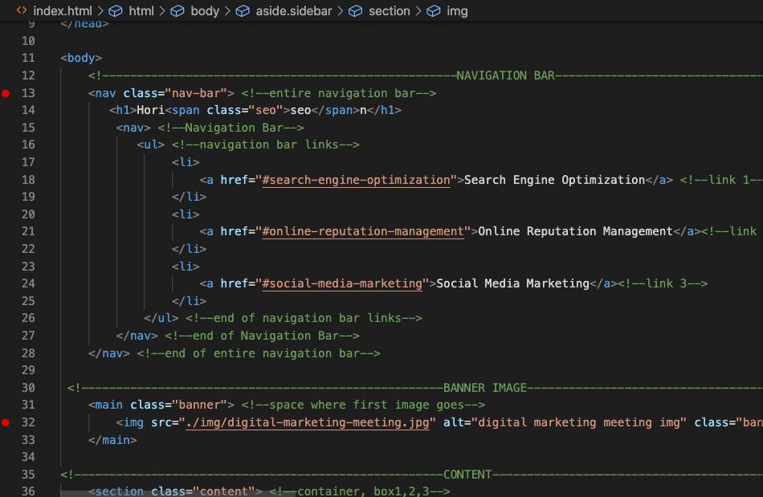

# Go For Launch

## Description 

This was the first assignment from the UConn Coding Boot Camp curriculum which combined the first week's topics: Git, Terminal, GitHub, GitHub Pages, HTML, CSS and Web Accessibility.

View the refactored web page [here](https://dsmooke.github.io/go-for-launch/)

## Goals

There were two goals to this assignment: 
1) To refractor, or restructure, the initial source code and modify it in order to improve its operation without altering its functionality.
2) To adhere to accessibility standards - ways in which people with disabilities can access.  

The goals can be further understood by the following definitions:

**HTML Accessibility:** *the ease with which a user is able to navigate and interact with your site; this involves making the HTML code as semantic as possible.*

**Semantic HTML:** *have the HTML element correspond to its correct purpose as much as possible.* 

Ex. Instead of using the non-semantic element (such as **div**) for Table#1 you could change the **div** element to the semantic element **table** so that the **table** element is referring to Table#1. 

**Semantic Elements:** *elements with meaning.*

### Instructions
Our instructions were based on a the following User Story:

```
AS A marketing agency
I WANT a codebase that follows accessibility standards
SO THAT our own site is optimized for search engines
```
Our webpage had to meet the following criteria: 

```
GIVEN a webpage meets accessibility standards
WHEN I view the source code
THEN I find semantic HTML elements
WHEN I view the structure of the HTML elements
THEN I find that the elements follow a logical structure independent of styling and positioning
WHEN I view the image elements
THEN I find accessible alt attributes
WHEN I view the heading attributes
THEN they fall in sequential order
WHEN I view the title element
THEN I find a concise, descriptive title
```

## Developer
The website for the marketing agency, Horiseon, experienced a number of non-semantic elements in the initial source code.  <!--image of original code without semantic elements-->
See initial commit for both HTML and CSS files. 

I focused on the following: changing non-semantic elemnts into semantic elements wherever possible, omitting redundancies, ensuring that each image link functioned properly, consolidating the CSS selectors, and providing detailed comments that describe each element's function as well as serving as labels for each section of the webpage (e.g. "Sidebar") <!--image of refactored code with semantic elements-->


<!--Future reference to view a webpage with a link: [TEXT TO SHOW](full URL) aka
[This is Relative Link Name](actual URL of webpage you are linking)-->

## Mock-Up

The following image shows the web application's appearance and functionality:

<!--image of working webpage-->


<!--for future reference: screenshot>save file to desktop>rename file>copy file>paste in home/dana/coding-bootcamp/HW1/img so that image registers in vs code> git add file in terminal and commit and push to github>to insert image link into readme copy the image's relative file path and paste into the code-->

- - -
© 2020 Trilogy Education Services, a 2U, Inc. brand. All Rights Reserved.# go-for-launch
